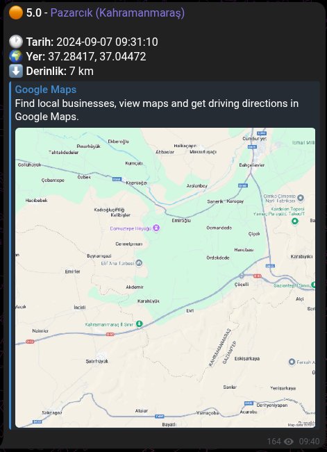

# AFAD Deprem Botu

Bu proje, Türkiye ve çevresinde meydana gelen güncel deprem verilerini AFAD API üzerinden anlık olarak çeken ve belirli büyüklüğün üzerindeki depremleri bir Telegram Kanalına otomatik olarak raporlayan bir Python botudur.

## Özellikler

Akıllı Filtreleme: Sadece belirlenen koordinatlar (Türkiye çevresi) ve büyüklük (Mag > 4.0) arasındaki depremleri raporlar.

Görsel Bildirimler: Deprem büyüklüğüne göre renkli emoji kodları kullanır:

* ⚫️ 7.0+ (Yıkıcı)

* 🔴 6.0 - 6.9 (Şiddetli)

* 🟠 5.0 - 5.9 (Orta)

* 🟡 4.0 - 4.9 (Hafif)

* Her bildirim, depremin merkez üssünü gösteren bir Google Haritalar linki içerir.

* 5.0 büyüklüğünün altındaki depremleri sessiz bildirim olarak gönderir.

Örnek Bildirim Çıktısı

