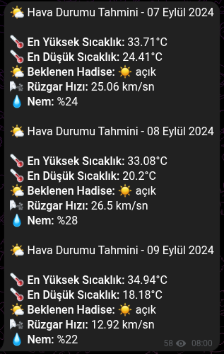

# İzmir Hava Durumu Tahmin Botu

Bu proje, OpenWeatherMap API'sini kullanarak İzmir için 3 günlük hava durumu tahminlerini çeken ve Telegram üzerinden anlık bildirim gönderen, Python tabanlı ve asenkron (async) çalışan bir sistemdir.

## Öne Çıkan Özellikler

* Günlük en yüksek/en düşük sıcaklık, nem oranı ve rüzgar hızı verilerini sunar.

* Hava durumuna göre (örneğin "parçalı bulutlu") otomatik emoji eşleştirmesi yaparak görsel bir kullanıcı deneyimi sağlar.

## Mantık ve Matematiksel Hesaplamalar

* **Rüzgar Hızı Dönüşümü:** Bot, API'den gelen metre/saniye ($m/s$) cinsindeki veriyi otomatik olarak kilometre/saat ($km/h$) birimine dönüştürür:

  $$V_{km/h} = V_{m/s} \times 3.6$$

Örnek Bildirim Çıktısı

