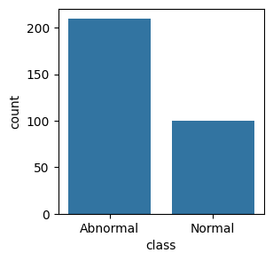
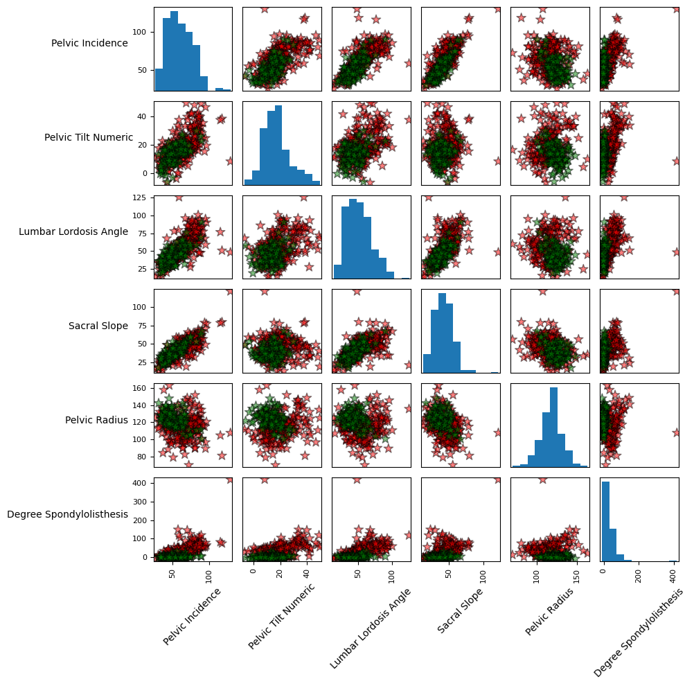
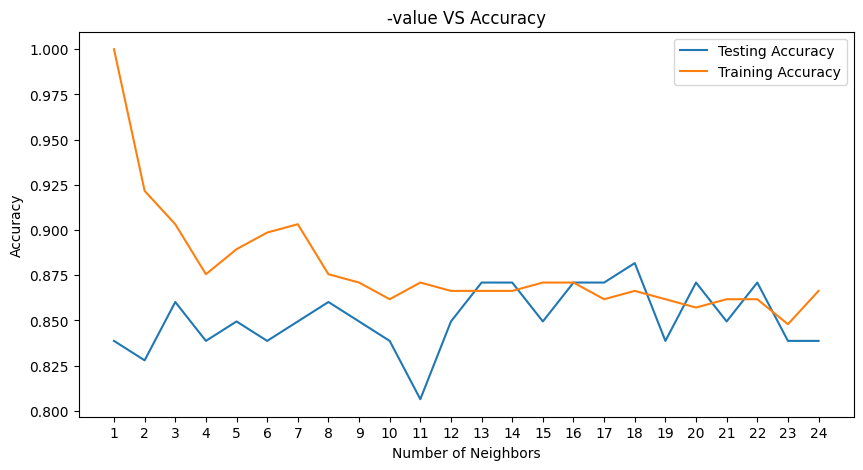
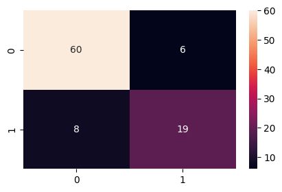
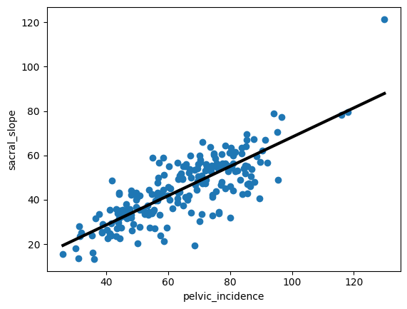

# Orthopedic Patients: Biomechanical Classification & Regression

Bu proje, ortopedik hastaların fiziksel muayenelerinden elde edilen biyomekanik verileri analiz ederek hastaları "Normal" veya "Anormal" olarak sınıflandırmayı ve anatomik değişkenler arasındaki ilişkileri regresyon modelleriyle anlamlandırmayı amaçlamaktadır.

## Veri Seti ve Keşifsel Veri Analizi (EDA)

Veri seti; Pelvic Incidence, Pelvic Tilt, Lumbar Lordosis Angle, Sacral Slope, Pelvic Radius, Degree Spondylolisthesis gibi 6 kritik biyomekanik öznitelikten oluşmaktadır. Analiz süreci, verinin yapısını anlamak için görselleştirme ile başlamıştır:

**Sınıf Dağılımı:** Veri setindeki sınıfların dengesi incelenmiş, "Abnormal" sınıfının daha baskın olduğu görülmüştür.

**İlişki Matrisi:** Değişkenlerin birbiriyle olan korelasyonu ve sınıfların öznitelik uzayındaki dağılımı scatter matrix ile analiz edilmiştir.

## Makine Öğrenmesi Uygulamaları

### 1. K-Nearest Neighbors (KNN) Sınıflandırma

Modelin başarısını artırmak için en uygun komşuluk sayısı ($K$) optimize edilmiştir:
* **Model Karmaşıklığı:** $K=1$ ile $K=25$ arasındaki değerler test edilerek overfitting (aşırı öğrenme) engellenmiştir.

* **Optimum Sonuç:** Test verisi üzerinde en yüksek doğruluk oranı **$K=18$** değeri ile **%88.17** olarak elde edilmiştir.

### 2. Random Forest ve Hata Analizi

Daha karmaşık bir sınıflandırma algoritması olan Random Forest kullanılarak hata analizi derinleştirilmiştir:

* **Confusion Matrix:** Modelin "Abnormal" hastaları yakalama başarısı (Recall) ve "Normal" hastaları karıştırma oranı detaylandırılmıştır.

* **Performans:** Model genel toplamda **%85** başarı skoru ile dengeli bir performans sergilemiştir.

## Regresyon Analizi

Hastalardaki biyomekanik değişkenlerin birbirini ne ölçüde tahmin edebildiği regresyon teknikleriyle ölçülmüştür:

**Linear Regression:** Pelvic Incidence ve Sacral Slope arasında güçlü bir doğrusal bağ saptanmıştır ($R^2 = 0.64$).

**Düzenlileştirme (Ridge & Lasso):** Modelin genellenebilirliğini artırmak için Ridge ve Lasso yöntemleri kullanılmış, Lasso ile gereksiz özniteliklerin katsayıları sıfıra yaklaştırılarak analiz sadeleştirilmiştir.

## Kullanılan Teknolojiler

| Kütüphane | Kullanım Amacı |
| :--- | :--- |
| **Pandas & NumPy** | Veri manipülasyonu ve matris işlemleri |
| **Matplotlib & Seaborn** | İstatistiksel görselleştirme ve grafikler |
| **Scikit-learn** | ML Algoritmaları (KNN, RF, Ridge, Lasso) |

## İletişim

| Kanal | Link |
| :--- | :--- |
| **LinkedIn** | [Profilime Git](https://www.linkedin.com/in/burcuuluag/) |