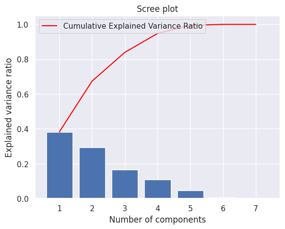
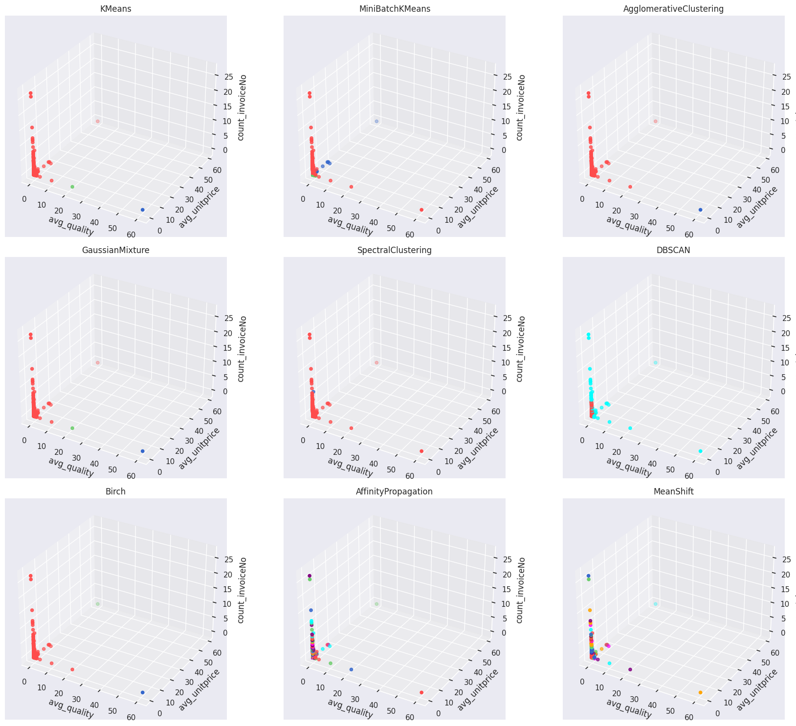

# Online Retail: Customer Segmentation & Behavioral Analytics

Bu proje, bir e-ticaret platformunun 2010-2011 yılları arasındaki satış verilerini kullanarak müşteri davranışlarını analiz eder. Veri bilimi döngüsü (Temizlik, EDA, Boyut İndirgeme ve Kümeleme) takip edilerek müşteriler stratejik gruplara ayrılmıştır.

## Analiz Süreci ve Veri Mühendisliği

### 1. Veri Temizliği ve Ön İşleme

Ham veri setindeki gürültüleri gidermek için şu kritik adımlar uygulanmıştır:

* **Eksik Veri Yönetimi:** Müşteri takibi yapılamayan (`CustomerID` null) 135.080 satır veri setinden çıkarılmıştır.

* **Aykırı Değer Analizi:** İade işlemlerini temsil eden negatif `Quantity` değerleri temizlenmiş, `UnitPrice` için %95 eşik değeri (quantile) kullanılarak ekstrem değerler filtrelenmiştir.

* **Normalizasyon:** Farklı ölçeklerdeki veriler (Miktar ve Fiyat) **StandardScaler** ile standardize edilmiştir.

### 2. Boyut İndirgeme (PCA)

7 farklı sayısal özellik (ortalama kalite, birim fiyat, fatura sayısı vb.) üzerinden yapılan PCA analizi sonucunda:
* İlk 3 temel bileşenin (PC1, PC2, PC3) toplam varyansın **%83.9**'unu açıkladığı saptanmıştır.
* Bu adım, verideki bilgiyi korurken kümeleme algoritmalarının daha performanslı çalışmasını sağlamıştır.

## Kümeleme ve Model Performansı

Proje kapsamında 9 farklı algoritma (K-Means, DBSCAN, Agglomerative, GMM vb.) karşılaştırılmıştır. 

| Metrik | K-Means (k=3) | Agglomerative | MiniBatch K-Means |
| :--- | :---: | :---: | :---: |
| **Silhouette Score** | **0.9880** | 0.9880 | 0.6919 |
| **Calinski-Harabasz**| **2706.58** | 2706.58 | 398.99 |

**Karar:** En yüksek Silhouette skoruna ve dengeli küme içi homojenliğe sahip olan **K-Means** (3 küme) final modeli olarak seçilmiştir.

## Stratejik Bulgular (Business Insights)

Analiz sonucunda elde edilen müşteri segmentlerinin 3D uzaydaki dağılımı:

3D görselleştirme ve istatistiksel analizler sonucunda 3 ana müşteri segmenti tanımlanmıştır:

* **🔴 Cluster 0 (Fırsatçılar):** Düşük birim fiyatlı ve düşük kaliteli ürünleri tercih eden, genellikle tek seferlik alım yapan grup.

  * *Aksiyon:* Sadakat programları ve kuponlarla geri kazanılmalı.

* **🟢 Cluster 1 (Dengeli Alıcılar):** Orta segment kaliteyi tercih eden, işlem sıklığı istikrarlı olan grup.

  * *Aksiyon:* Çapraz satış (cross-selling) ile sepet hacmi büyütülmeli.

* **🔵 Cluster 2 (VIP / Kalite Odaklı):** En yüksek birim fiyatlı ve yüksek kaliteli ürünleri satın alan, şirketin kârlılık oranı en yüksek segmenti.

  * *Aksiyon:* Özel müşteri temsilcisi ve kişiselleştirilmiş lüks ürün önerileri sunulmalı.

## Kullanılan Teknolojiler

* **Python 3.11**
* **Veri Analizi:** Pandas, NumPy
* **Makine Öğrenmesi:** Scikit-learn (PCA, KMeans, DBSCAN, Scaler)
* **Görselleştirme:** Matplotlib (3D Projection), Seaborn

## İletişim

| Kanal | Link |
| :--- | :--- |
| **LinkedIn** | [Profilime Git](https://www.linkedin.com/in/burcuuluag/) |