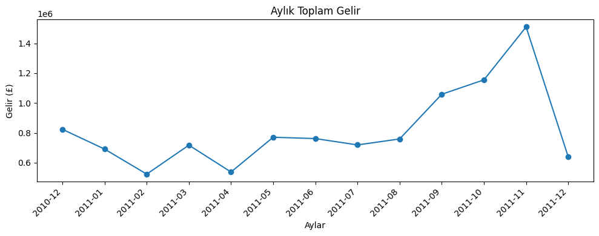
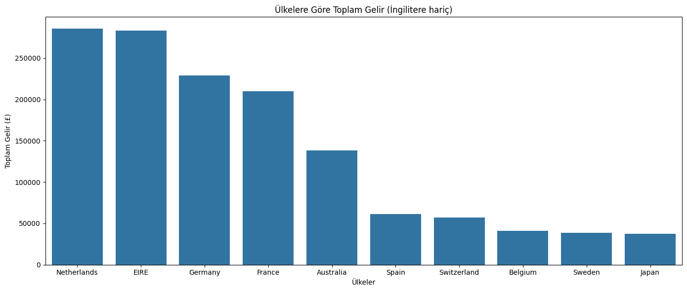
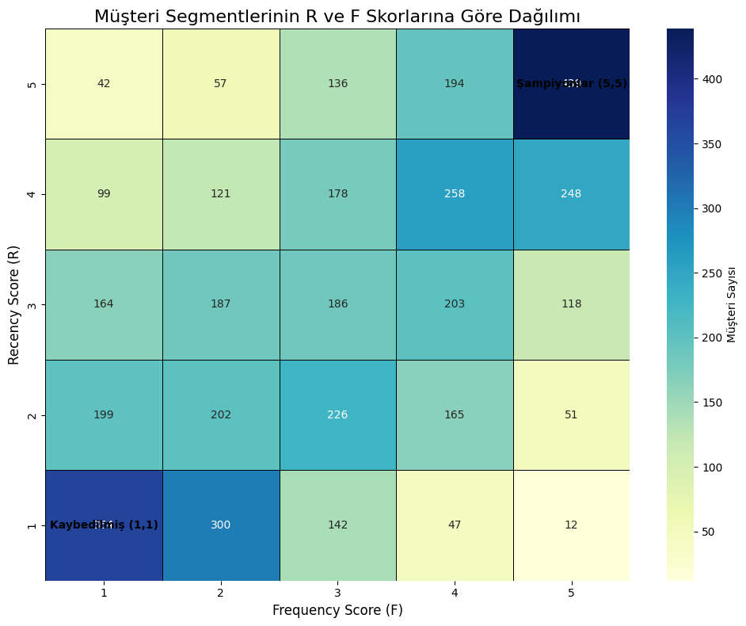

# Online Retail: Sales Trends & RFM Customer Segmentation

Bu proje, bir e-ticaret platformunun satış performansını zaman serisi analizi ile incelemekte ve müşterileri **RFM (Recency, Frequency, Monetary)** metodolojisiyle segmentlere ayırarak stratejik pazarlama önerileri sunmaktadır.

## Analiz ve Veri Temizliği

Analiz süreci, veri setindeki gürültülerin (iade işlemleri, eksik müşteri bilgileri ve ekstrem uç değerler) ayıklanmasıyla başlamıştır:

* **Veri Temizliği:** Miktar (`Quantity`) ve birim fiyatı sıfırdan küçük olan tüm hatalı/iade kayıtlar ayıklanmıştır.

* **Müşteri Odaklılık:** RFM analizi için kritik olan `CustomerID` sütunundaki eksik veriler temizlenerek, sadece gerçekliği doğrulanmış 4.338 benzersiz müşteri üzerinden analiz derinleştirilmiştir.

## Satış Trendleri ve Zaman Serisi Analizi

Veri seti üzerinden yapılan zaman serisi incelemesi, işletmenin mevsimsel döngüsünü ortaya koymuştur:

**Öne Çıkan Bulgular:**

* Yılın ilk 8 ayı boyunca gelir 500k-700k £ bandında dalgalanırken, **Eylül ayı itibarıyla** belirgin bir artış trendi başlamaktadır.

* **Kasım 2011**, Kara Cuma (Black Friday) ve Noel hazırlıkları etkisiyle gelirin zirve yaptığı (`~1.5M £`) aydır.

## Global Pazar Analizi

Şirketin gelir yapısı ülke bazlı incelendiğinde, Birleşik Krallık (UK) pazarının domine edici etkisi görülmektedir. UK dışındaki uluslararası pazarlar incelendiğinde ise:

* **Hollanda (Netherlands)**, yaklaşık 285k £ ile uluslararası gelirde liderdir.
* Onu İrlanda, Almanya ve Fransa takip etmektedir. Bu dört ülke, şirketin uluslararası büyüme stratejisinin merkezini oluşturmaktadır.

## RFM Müşteri Segmentasyonu

Müşterilerin alışveriş alışkanlıklarını anlamak için R (Yenilik), F (Sıklık) ve M (Parasal Değer) skorları hesaplanmış ve 5 ana gruba ayrılmıştır:

### Stratejik Segment Yönetimi

| Segment | Özellikler | Aksiyon Önerisi |
| :--- | :--- | :--- |
| **Sadık Şampiyonlar** | Ortalama 6,038 £ harcama, 11 işlem. | VIP sadakat programları ve özel önizlemeler sunulmalı. |
| **Risk Altında** | Ortalama 1,575 £ harcama ancak 137 gündür pasif. | "Sizi özledik" kampanyaları ve kişiselleştirilmiş indirimler uygulanmalı. |
| **Yeni Müşteriler** | Yakın zamanda ilk alışverişini yapmış (18 gün önce). | Güven inşa edecek hoş geldin mailleri ve ikinci alışveriş teşviki verilmeli. |
| **Kaybedilmişler** | Hem harcaması düşük hem de çok uzun süredir pasif. | Geri kazanım maliyeti yüksek olduğu için düşük maliyetli kanallar seçilmeli. |

## Kullanılan Teknolojiler

* **Diller:** Python 3.x
* **Kütüphaneler:** Pandas, NumPy, Matplotlib, Seaborn, Datetime
* **Analiz Yöntemleri:** RFM Scoring, Time Series Analysis, EDA (Exploratory Data Analysis)

## İletişim

| Kanal | Link |
| :--- | :--- |
| **LinkedIn** | [Profilime Git](https://www.linkedin.com/in/burcuuluag/) |