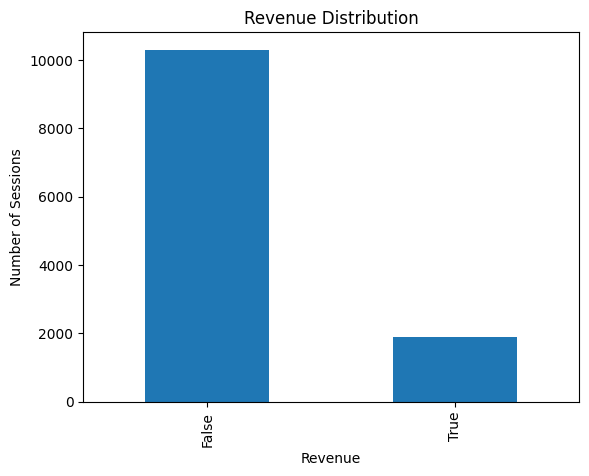
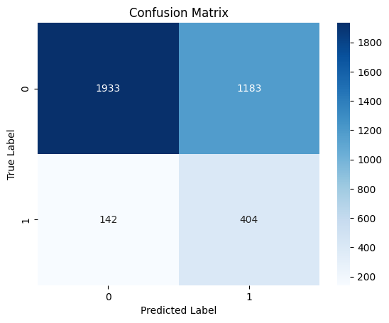
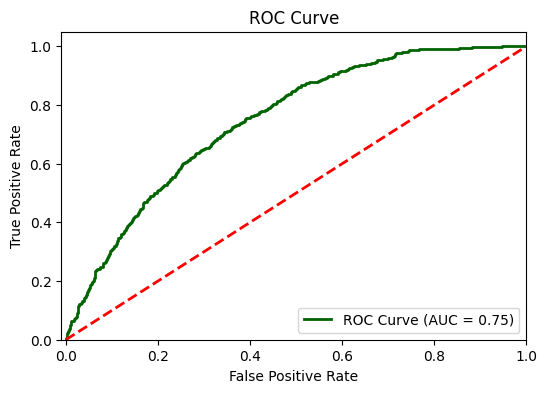

# Online Shoppers Purchasing Intention

Bu proje, bir e-ticaret sitesindeki ziyaretçilerin davranışsal verilerini (ziyaret süreleri, sayfa değerleri, özel gün yakınlığı vb.) analiz ederek, ziyaretin bir **satın alma (Revenue)** ile sonuçlanıp sonuçlanmayacağını **Lojistik Regresyon** modeli ile tahmin eder.

## Veri Seti ve Ön İşleme

Analizde kullanılan veri seti 12.330 gözlemden oluşmaktadır. Modelin başarısı için uygulanan veri mühendisliği adımları:

* **Gürültü Temizliği:** Yinelenen (duplicate) satırlar kaldırılarak veri kalitesi artırılmıştır.

* **Özellik Mühendisliği:** Kategorik değişkenler (Ay, Ziyaretçi Tipi vb.) `One-Hot Encoding` yöntemi ile modele hazır hale getirilmiş, `Weekend` değişkeni ikili (binary) formata dönüştürülmüştür.

* **Ölçeklendirme:** Sayısal değişkenlerin model üzerindeki etkisini dengelemek için `StandardScaler` uygulanmıştır.

* **Sınıf Dengeleme:** Veri setinde satın alma gerçekleşmeyen oturumların sayısı baskın olduğundan, modelde `class_weight='balanced'` parametresi kullanılarak azınlık sınıfın (satın alanlar) öğrenilmesi sağlanmıştır.

## Keşifsel Veri Analizi (EDA)

Ziyaretçi davranışlarının satın alma üzerindeki etkileri incelenmiştir:

**Öne Çıkan Bulgular:**

* **Hafta Sonu Etkisi:** Hafta sonu yapılan ziyaretlerin satın alma ile sonuçlanma oranı, hafta içine göre daha yüksektir.

* **Mevsimsellik:** Kasım ayı, yılın en yüksek satın alma niyetine sahip dönemidir.

## Model Performansı ve Hiperparametre Optimizasyonu

Model, `GridSearchCV` kullanılarak en iyi hiperparametreler (`C: 1.0`, `penalty: 'l2'`) ile eğitilmiştir.

### Confusion Matrix

Modelin sınıflandırma kararları aşağıdaki matriste özetlenmiştir:

* **TP (Doğru Pozitif):** 404 | **TN (Doğru Negatif):** 1932

* **FP (Yanlış Pozitif):** 1184 | **FN (Yanlış Negatif):** 142

### Performans Metrikleri

| Metrik | False (Satın Almayan) | True (Satın Alan) |
| :--- | :---: | :---: |
| **Precision** | 0.93 | 0.25 |
| **Recall** | 0.62 | 0.74 |
| **F1-Score** | 0.74 | 0.38 |

**Analiz:** Modelin **Recall (Duyarlılık)** değeri %74'tür. Bu, potansiyel alıcıların büyük bir kısmını yakalayabildiğimizi göstermektedir. Düşük Precision değeri ise modelin "satın alabilir" dediği bazı kullanıcıların aslında almadığını gösterir; ancak e-ticaret stratejisinde potansiyel müşteriyi kaçırmamak (Yüksek Recall) genellikle daha kritiktir.

## Model Değerlendirmesi (ROC Curve)

Modelin sınıfları birbirinden ayırma kapasitesi ROC eğrisi ile doğrulanmıştır:

**Alan (AUC) = 0.74:** Modelin şans eseri tahminden çok daha iyi bir ayrım gücüne sahip olduğunu kanıtlar.

## Kullanılan Teknolojiler

* **Python:** Pandas, NumPy
* **Makine Öğrenmesi:** Scikit-learn (Logistic Regression, GridSearchCV, StandardScaler)
* **Görselleştirme:** Matplotlib, Seaborn

## İletişim

| Kanal | Link |
| :--- | :--- |
| **LinkedIn** | [Profilime Git](https://www.linkedin.com/in/burcuuluag/) |