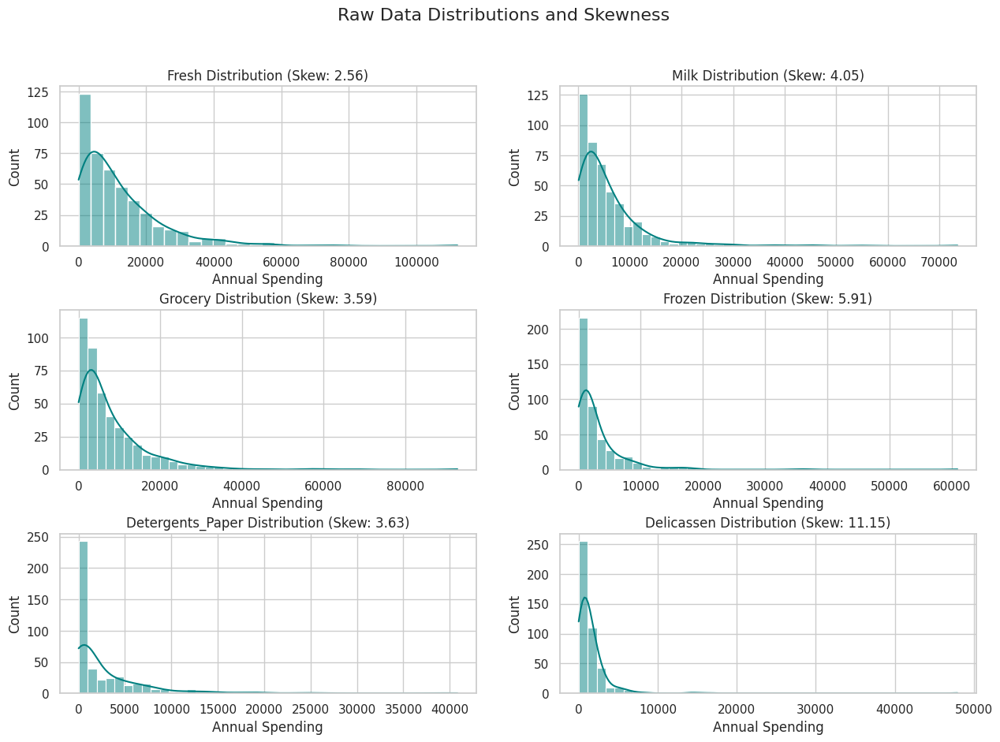
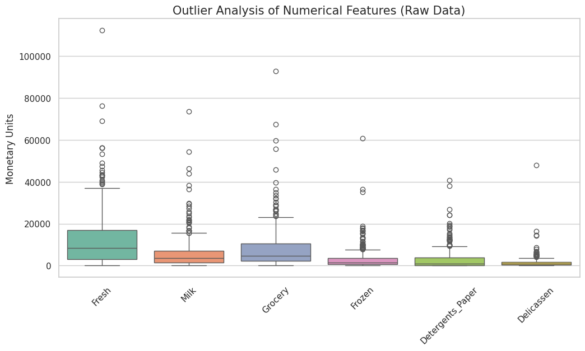
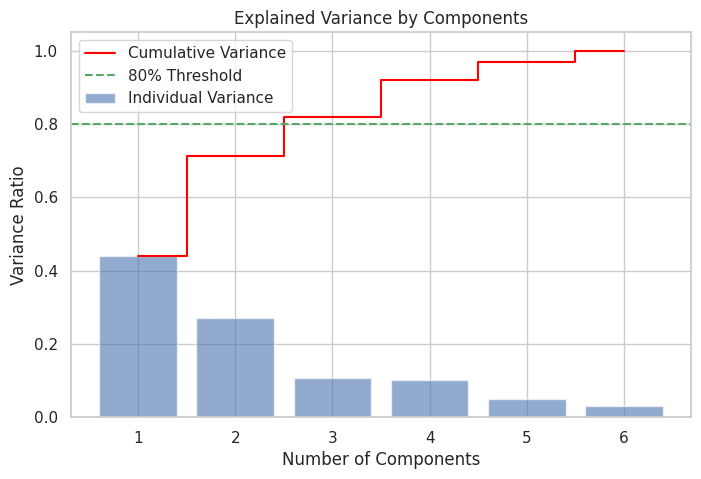
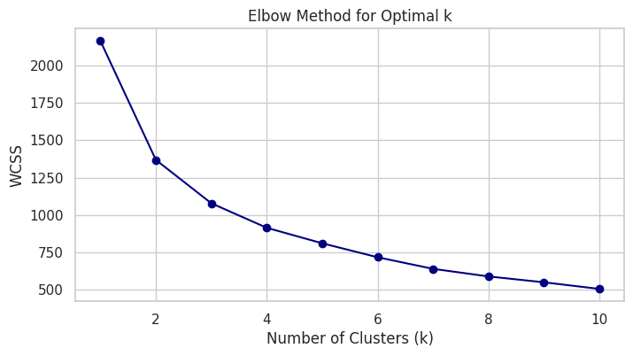
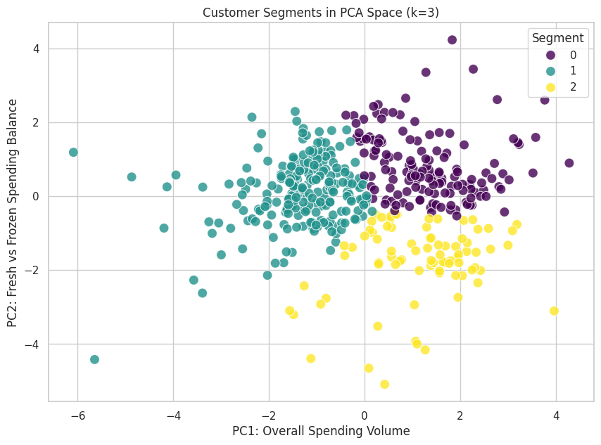
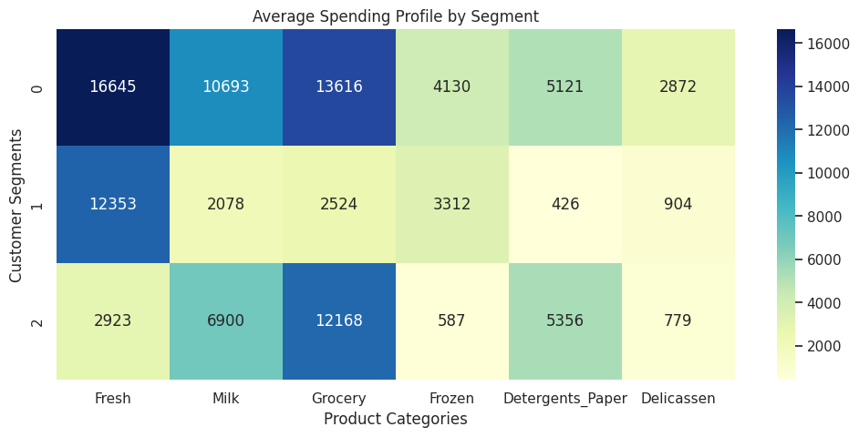

# Wholesale Customers Clustering & PCA Analysis

Bu proje, toptan satış yapan bir firmanın müşterilerini yıllık harcama alışkanlıklarına göre segmentlere ayırmayı amaçlamaktadır. Analiz sürecinde Temel Bileşenler Analizi (PCA) ile boyut indirgeme yapılmış ve farklı denetimsiz öğrenme (unsupervised learning) algoritmaları performans kriterlerine göre kıyaslanmıştır.

## Veri Seti Hakkında

Veri seti, 440 müşterinin 6 farklı ürün kategorisindeki yıllık harcamalarını içermektedir:

* Fresh, Milk, Grocery, Frozen, Detergents_Paper ve Delicassen.

## Analiz Süreci

**Veri Ön İşleme (Preprocessing)**

* **Logaritmik Dönüşüm:** Veri setinde sağa çarpıklık (skewness) ve uç değerlerin (outliers) etkisini minimize etmek için *log(x+1)* dönüşümü uygulanmıştır.

* **Standardizasyon:** Mesafe tabanlı algoritmaların doğruluğu için StandardScaler kullanılarak tüm özellikler aynı ölçeğe getirilmiştir.

## Boyut İndirgeme (PCA)

* Verinin varyans yapısını anlamak için PCA uygulanmıştır.

* İlk 3 bileşenin toplam varyansın %80'inden fazlasını açıkladığı tespit edildiği için analiz 3 bileşen üzerinden yapılmıştır.

## Kümeleme Stratejisi ve Model Seçimi

* **Elbow Method:** WCSS değerleri incelenerek en uygun küme sayısı k=3 olarak belirlenmiştir.

* 5 farklı algoritma (K-Means, Spectral, Agglomerative, GMM, Birch) kıyaslanmıştır:

Karar: Spectral Clustering en yüksek Silhouette skoruna sahip olsa da, K-Means algoritması Calinski-Harabasz skorunda (küme içi yoğunluk başarısı) çok daha üstün olduğu ve iş dünyasında daha yorumlanabilir olduğu için final modeli olarak seçilmiştir.

| Algorithm        | Silhouette | Calinski | Davies-Bouldin |
|------------------|------------|----------|----------------|
| Spectral         | 0.345102   | 148.426109 | 0.922094     |
| KMeans           | 0.333262   | 219.912765 | 1.100502     |
| Agglomerative    | 0.317706   | 196.125604 | 1.040228     |
| GMM              | 0.307029   | 142.570837 | 1.689815     |
| Birch            | 0.202070   | 134.673640 | 1.197453     |

## Final Kümeleme Sonucu (PCA Uzayında)

Aşağıdaki grafik, müşterilerin harcama hacmi (PC1) ve ürün dengesi (PC2) eksenlerinde nasıl kümelendiğini göstermektedir:

## Müşteri Segment Profilleri

Final modeli sonucunda 3 ana segment tanımlanmıştır:

* **Segment 0 (VIP / Büyük Ölçekli Alıcılar):** Hemen hemen tüm kategorilerde (özellikle Fresh ve Grocery) en yüksek hacimli alım yapan grup.
* **Segment 1 (Restoran / Kafe / Otel):** Ağırlıklı olarak Taze (Fresh) gıdaya odaklanan, perakende ürünlerinde düşük hacimli grup.
* **Segment 2 (Perakende / Market):** Grocery ve Detergents_Paper harcamaları belirgin şekilde yüksek olan grup.

## İletişim

| Kanal | Link |
| :--- | :--- |
| **LinkedIn** | [Profilime Git](https://www.linkedin.com/in/burcuuluag/) |