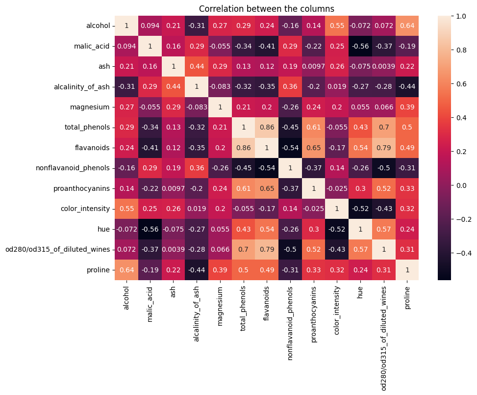
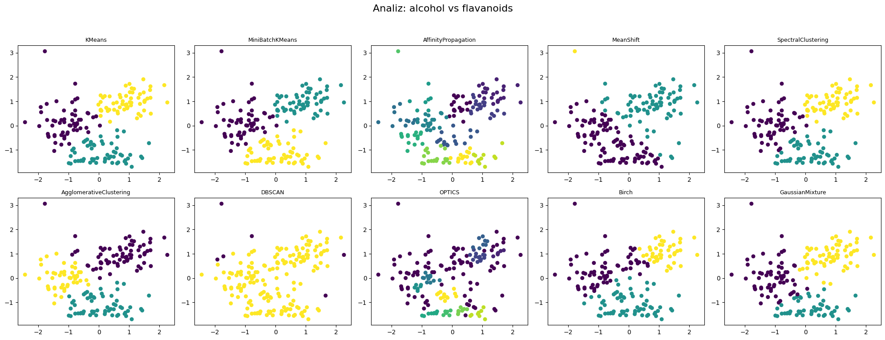
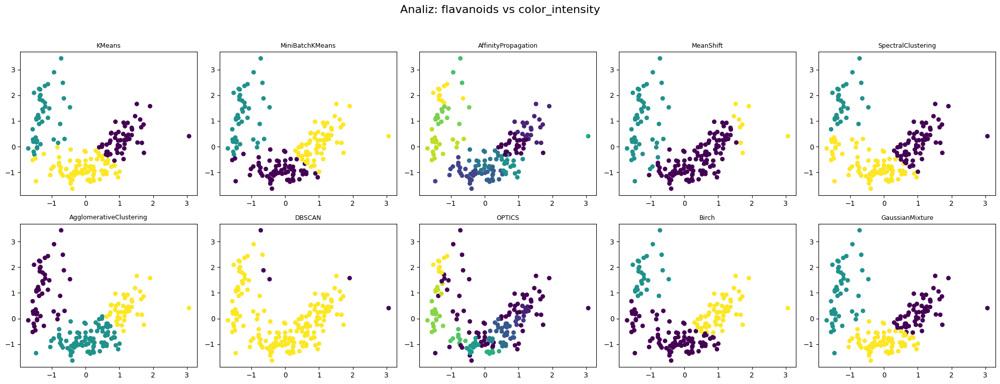
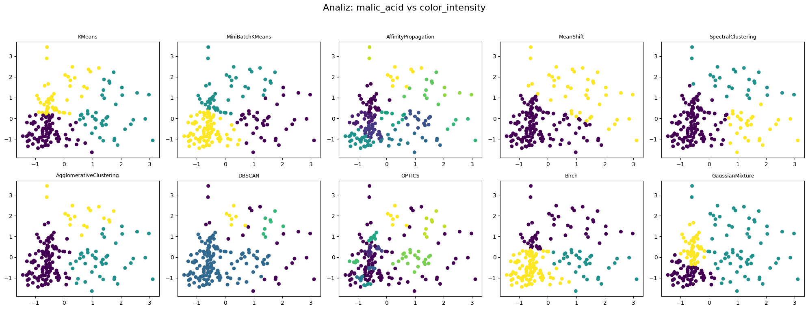

# Wine Data Clustering: Multi-Algorithmic Performance Analysis

Bu proje, Scikit-Learn kütüphanesindeki Wine Veri Seti kullanılarak, farklı denetimsiz öğrenme (unsupervised learning) algoritmalarının kümeleme performanslarını karşılaştırmalı olarak analiz eder. Projenin temel amacı, farklı özellik kombinasyonları altında hangi algoritmaların daha kararlı ve başarılı sonuçlar verdiğini saptamaktır.

## Veri Seti Hakkında

Wine veri seti, 178 şarap örneği ve bunların 13 farklı kimyasal özelliğini (Alkol oranı, Fenol değerleri, Renk yoğunluğu vb.) içermektedir. Analiz aşamasında veriler StandardScaler ile normalize edilmiştir.

## Analiz Metodolojisi

Korelasyon analizi sonucunda şarabın yapısını en iyi temsil eden üç farklı kombinasyon seçilmiştir:

* Alcohol - Flavanoids

* Malic Acid - Color Intensity

* Flavanoids - Color Intensity

Kümeleme sonuçları:

Performans değerlendirmesi için Silhouette Score, Davies-Bouldin Index ve Calinski-Harabasz Score kullanılmıştır ve yapılan testler sonucunda en iyi algoritmalar belirlenmiştir:

| Kombinasyon                      | En İyi Algoritma           | Silhouette |
|----------------------------------|----------------------------|------------|
| alcohol - flavanoids             | KMeans                     | 0.499      |
| malic_acid - color_intensity     | SpectralClustering         | 0.469      |
| flavanoids - color_intensity     | AgglomerativeClustering   | 0.479      |

## İletişim

| Kanal | Link |
| :--- | :--- |
| **LinkedIn** | [Profilime Git](https://www.linkedin.com/in/burcuuluag/) |