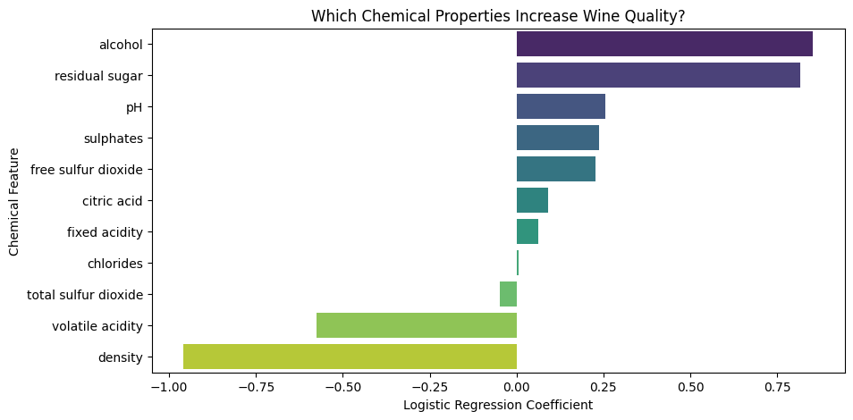

# White Wine Quality Classification with Logistic Regression

Bu proje, kimyasal özelliklerine dayanarak beyaz şarapların kalitesini tahmin etmek için Lojistik Regresyon modelini kullanır. Proje sürecinde, ham veri analizi, veri temizleme ve model performansını maksimize etmek için stratejik hedef değişkeni dönüşümü (Binary Classification) uygulanmıştır.

## Proje Özeti

Veri seti başlangıçta 3 ile 9 arasında değişen kalite puanları içeriyordu. Ancak, veri setindeki sınıfların dengesizliği (örneğin 9 puanlı şarap sayısının azlığı) ve çok yakın puanlar arasındaki karmaşıklık nedeniyle, problem daha yüksek iş değerine sahip olan İkili Sınıflandırma (Binary Classification) problemine dönüştürülmüştür:

* 0 (Low/Medium): 6 puan altındaki şaraplar.

* 1 (High): 6 puan ve üzerindeki kaliteli şaraplar.

## Model Performansı

Yapılan iyileştirmeler ve class_weight='balanced' parametresi kullanımı sonucunda elde edilen sonuçlar:

| Metric             | Value  |
|--------------------|--------|
| Accuracy           | 71.12% |
| ROC-AUC            | 0.792  |
| Weighted F1-Score  |  0.72  |

| Class              | Precision | Recall | F1-Score |
|--------------------|-----------|--------|----------|
| Low / Medium (0–5) | 0.56      | 0.71   | 0.63     |
| High (6–9)         | 0.83      | 0.71   | 0.76     |

## Lojistik Regresyon

Lojistik Regresyon katsayıları analiz edildiğinde, şarap kalitesini en çok etkileyen faktörler aşağıda görselleştirilmiştir:

* **Pozitif Etki:* Alkol oranı (alcohol) ve artık şeker (residual sugar) miktarı arttıkça şarabın "İyi" olarak sınıflandırılma olasılığı yükselmektedir.

* **Negatif Etki:** density (yoğunluk) ve volatile acidity (uçucu asidite) arttıkça kalite puanının düşme eğiliminde olduğu saptanmıştır.

## İletişim

| Kanal | Link |
| :--- | :--- |
| **LinkedIn** | [Profilime Git](https://www.linkedin.com/in/burcuuluag/) |